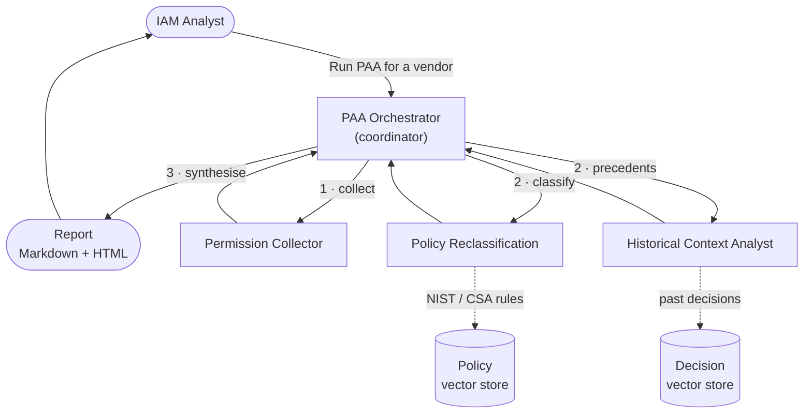
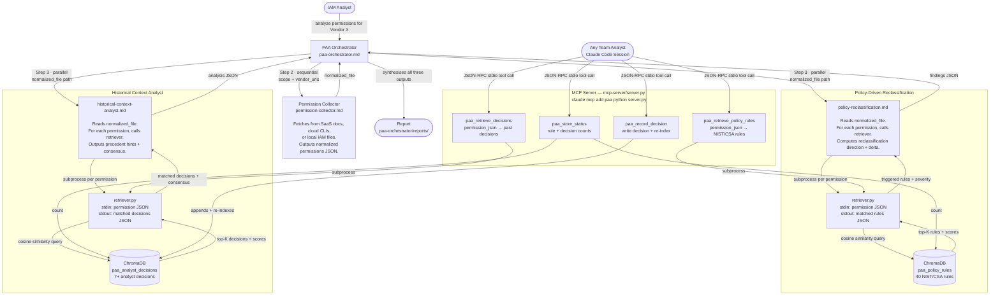

# PAA — Permissions Analyser Agent

Multi-agent system that collects SaaS/cloud permissions, evaluates them against NIST/CSA policy rules via RAG, surfaces historical analyst precedents, and produces a risk-ranked report with reclassification recommendations.

## Architecture

### At a glance



The analyst kicks off the Orchestrator, which runs the Collector first, then the
Policy and Historical agents together — each consulting its own vector store —
and finally synthesises everything into the report.

### Detailed agent flow with RAG and MCP



Source: [`architecture.md`](architecture.md)

---

## Quick start

```bash
# 1. Clone and enter the project
git clone https://github.com/spallem1/CMU-Capstone.git
cd CMU-Capstone

# 2. Install Python dependencies
pip install -r policy-reclassification/rag/requirements.txt \
            -r historical-context-analyst/rag/requirements.txt \
            -r mcp-server/requirements.txt

# 3. Launch Claude Code FROM THIS DIRECTORY
claude
```

Then, **inside the Claude Code session** (not your shell):

```
/paa-index-policies      ← build the policy vector store (one time)
/paa-index-decisions     ← seed the decision store from the bundled examples (one time)
Run PAA for Okta         ← start an analysis
```

> ⚠️ **Where commands run matters.** Anything shown as a slash command (`/paa-…`)
> or a natural-language prompt (`Run PAA for Okta`) is typed **into the Claude Code
> session**, and only works when `claude` was launched from the project root — the
> agents live in `.claude/agents/` and load only for this directory. Shell commands
> (`git`, `cd`, `pip`) run in your terminal as usual.

See [One-time setup](#one-time-setup) for details and the optional MCP server.

---

## Prerequisites

- Python 3.9+
- Claude Code CLI (`claude`) with an active Anthropic account
- Git

---

## One-time setup

> Steps 1 and 4 run in your **shell**. Steps 2 and 3 are slash commands typed
> **inside a Claude Code session** that was launched from the project root.

### 1. Install Python dependencies

```bash
pip install -r policy-reclassification/rag/requirements.txt
pip install -r historical-context-analyst/rag/requirements.txt
pip install -r mcp-server/requirements.txt
```

### 2. Index the policy rules

Embeds all NIST/CSA rules from `policy-reclassification/policies/` into ChromaDB.

```
/paa-index-policies
```

Verify the store is ready — should report ~40 rule embeddings.

### 3. Seed the decision store (optional but recommended)

If you have existing analyst decision files in `historical-context-analyst/decisions/`, index them now:

```
/paa-index-decisions
```

If the folder is empty, skip this — the Historical Context Analyst will return "no precedents" until decisions are recorded.

### 4. Register the MCP server (optional)

Gives any Claude Code session direct access to the PAA RAG pipelines as tools (`paa_store_status`, `paa_retrieve_policy_rules`, `paa_retrieve_decisions`, `paa_record_decision`).

```bash
claude mcp add paa python /absolute/path/to/mcp-server/server.py
```

Verify registration:

```
/mcp
```

---

## Running an analysis

Start the PAA Orchestrator agent:

```
analyze permissions for <Vendor>
```

or explicitly:

```
Run PAA for Okta
```

The orchestrator walks you through intake (source type, URLs, scope focus), then:

1. Spawns the **Permission Collector** to fetch and normalise permissions
2. For each permission — one at a time — spawns the **Policy Agent** + **Historical Agent** in parallel and prints a live progress line:
   ```
   🔍 [3/45]  `okta.users.manage`
      Collector: HIGH  |  Vendor: UNRATED
      Actions: okta:users:manage  |  Manages perms: true

   ✅ [3/45]  `okta.users.manage`
      Policy: HIGH (upgraded)  |  Rules: ZTA-005, AC-6
      Signal: policy_upgrade  |  Evidence: policy_only
      History: No precedents
   ```
3. Writes a **Markdown report** and an interactive **HTML report** to `paa-orchestrator/reports/`

### Scope focus (optional)

To analyse only specific roles or scopes instead of all permissions, provide them at intake when prompted. Example: `okta.users.manage, okta.groups.manage`.

---

## After the analysis

### Record your decisions

After reviewing the report, record your final rating calls so future analyses can use them as precedents:

```
/paa-record-decision
```

This walks through each non-compliant finding, collects your decision (confirm / upgrade / downgrade / accept vendor rating) and rationale, writes a decision batch file, and re-indexes the decision store automatically.

Alternatively, use the MCP tool directly from any Claude Code session:

```json
paa_record_decision({
  "permission_id": "okta-001",
  "permission": { ... },
  "final_rating": "HIGH",
  "decision": "escalate",
  "rationale": "Token revocation scope is org-wide — treat as HIGH regardless of vendor UNRATED.",
  "analyst_confidence": "high",
  "analyst": "analyst@example.com",
  "vendor_rating": "UNRATED",
  "policy_severity": "INFO",
  "orchestrator_signal": "conflicting"
})
```

`review_due` is auto-set to +180 days. Decisions past their `review_due` date are excluded from future consensus until re-evaluated.

### Re-index after adding decisions manually

If you edit decision files directly:

```
/paa-index-decisions --reset
```

---

## Slash commands

| Command | What it does |
|---------|-------------|
| `/paa-index-policies` | Build/refresh the policy rule vector store |
| `/paa-index-decisions` | Build/refresh the analyst decision vector store |
| `/paa-record-decision` | Interactive post-analysis decision recording |
| `/paa-report` | Regenerate the HTML report from an existing findings file |

---

## Project structure

```
PAA-Claude-MultiAgent/
├── .claude/
│   ├── agents/
│   │   ├── paa-orchestrator.md          # Orchestrator agent prompt
│   │   ├── permission-collector.md      # Permission Collector agent prompt
│   │   ├── policy-reclassification.md   # Policy Agent prompt
│   │   └── historical-context-analyst.md# Historical Agent prompt
│   └── commands/
│       ├── paa-index-policies.md        # /paa-index-policies skill
│       ├── paa-index-decisions.md       # /paa-index-decisions skill
│       ├── paa-record-decision.md       # /paa-record-decision skill
│       └── paa-report.md               # /paa-report skill
│
├── permission-collector/
│   ├── schema/                          # normalized_permission_schema.json (v2.0)
│   ├── snapshots/                       # Raw as-downloaded permission snapshots
│   └── normalized/                      # Normalized permission files (schema v2.0)
│
├── policy-reclassification/
│   ├── policies/                        # NIST/CSA policy rule JSON files
│   ├── rag/                             # indexer.py, retriever.py, config.py
│   ├── vector_store/                    # ChromaDB — paa_policy_rules collection
│   └── findings/                        # Per-analysis reclassification output
│
├── historical-context-analyst/
│   ├── decisions/                       # Analyst decision batch JSON files
│   │   └── audit.log                   # Append-only decision audit log
│   ├── rag/                             # indexer.py, retriever.py, config.py
│   ├── vector_store/                    # ChromaDB — paa_analyst_decisions collection
│   └── analysis/                        # Per-analysis historical context output
│
├── mcp-server/
│   └── server.py                        # FastMCP server (4 tools)
│
└── paa-orchestrator/
    ├── html_report.py                   # HTML report generator
    └── reports/                         # Markdown + HTML analysis reports
```

---

## Normalised permission schema

All collected permissions conform to `permission-collector/schema/normalized_permission_schema.json` (schema version 2.0).

Key fields per permission:
- `normalization_confidence` — float 0.0–1.0; entries < 0.75 excluded from policy RAG, entries < 0.70 flagged as `normalization_status: "unverified"`
- `risk_rating_by_vendor` — strictly vendor-sourced; `UNRATED` when vendor doesn't publish
- `risk_rating_collector` — always PAA-derived (CRITICAL/HIGH/MEDIUM/LOW/INFO)
- `resource_scope` — array (PAA equivalent of the vendor's resource field)
- `snapshot_count_check` — integrity gate; mismatch excludes the file from downstream agents

The collector always writes a **raw snapshot first** (`permission-collector/snapshots/`) before the normalised file, preserving the verbatim vendor text as an audit record.
