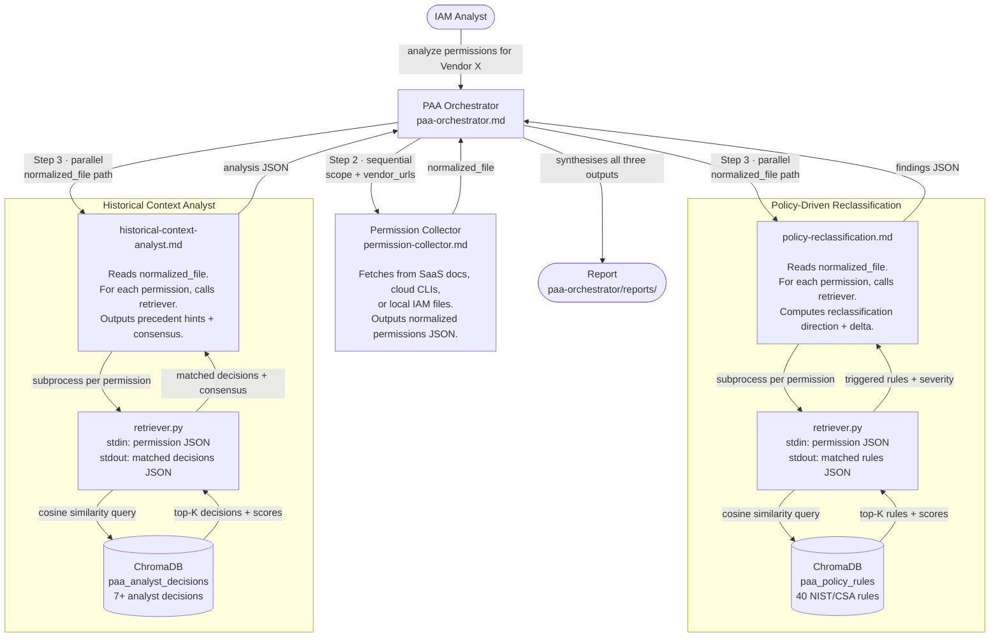

# PAA System Architecture

## Agent Flow with RAG

```mermaid
flowchart TD
    ANALYST(["IAM Analyst"])

    ANALYST -->|"analyze permissions for Vendor X"| ORC

    ORC["PAA Orchestrator\npaa-orchestrator.md"]

    ORC -->|"Step 2 · sequential\nscope + vendor_urls"| PC
    ORC -->|"Step 3 · parallel\nnormalized_file path"| PRA
    ORC -->|"Step 3 · parallel\nnormalized_file path"| HCA

    PC["Permission Collector\npermission-collector.md\n\nFetches from SaaS docs, cloud CLIs,\nor local IAM files.\nOutputs normalized permissions JSON."]

    PC -->|"normalized_file"| ORC

    subgraph RECLASSIFY["Policy-Driven Reclassification"]
        PRA["policy-reclassification.md\n\nReads normalized_file.\nFor each permission, calls retriever.\nComputes reclassification direction + delta."]
        PRET["retriever.py\nstdin: permission JSON\nstdout: matched rules JSON"]
        PVS[("ChromaDB\npaa_policy_rules\n40 NIST/CSA rules")]

        PRA -->|"subprocess per permission"| PRET
        PRET -->|"cosine similarity query"| PVS
        PVS -->|"top-K rules + scores"| PRET
        PRET -->|"triggered rules + severity"| PRA
    end

    subgraph HISTORY["Historical Context Analyst"]
        HCA["historical-context-analyst.md\n\nReads normalized_file.\nFor each permission, calls retriever.\nOutputs precedent hints + consensus."]
        DRET["retriever.py\nstdin: permission JSON\nstdout: matched decisions JSON"]
        DVS[("ChromaDB\npaa_analyst_decisions\n7+ analyst decisions")]

        HCA -->|"subprocess per permission"| DRET
        DRET -->|"cosine similarity query"| DVS
        DVS -->|"top-K decisions + scores"| DRET
        DRET -->|"matched decisions + consensus"| HCA
    end

    PRA -->|"findings JSON"| ORC
    HCA -->|"analysis JSON"| ORC

    ORC -->|"synthesises all three outputs"| RPT(["Report\npaa-orchestrator/reports/"])
```
